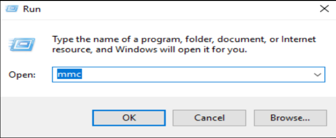
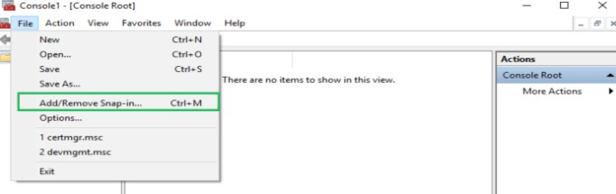
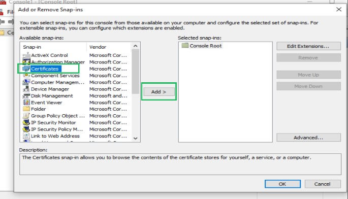
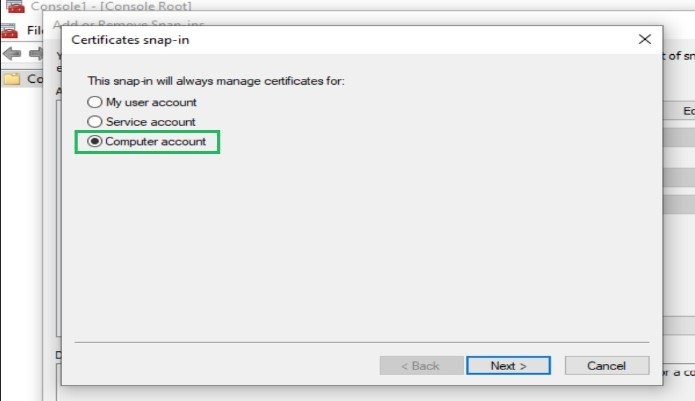
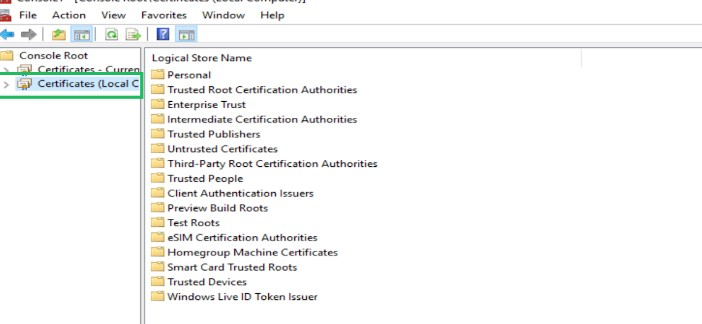
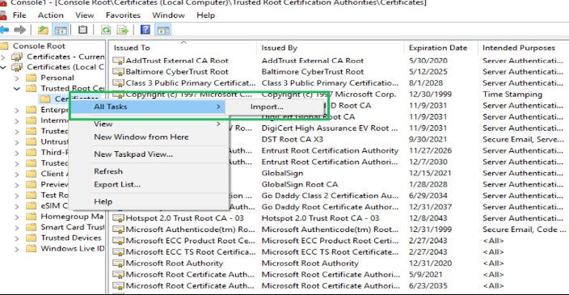
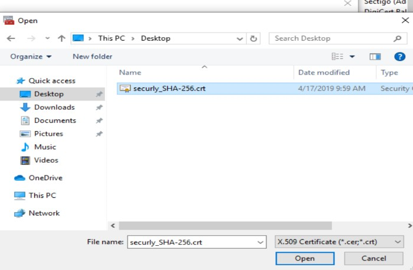
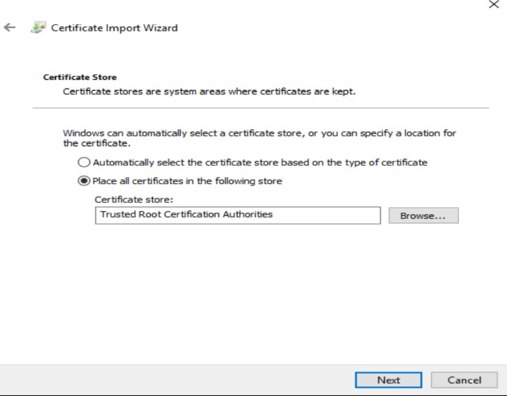

## Window Set-up 

Download the certificate attached at the end of this article.
Right-click on "Start" and select "Run". 

Type in ‘mmc’ and click on ‘OK’.
On the "User Account Control" screen, click on "Yes."
Once the Microsoft Management Console opens, click on "File" and select "Add/Remove Snap-in".

In the left menu, select ‘Certificates’ and click on 'Add'.

On the next screen, click the radio button next to "Computer account" and click on "Next".

Click on "Finish". 
Once you have returned the. To add or Remove Snap-ins and screens, click on "OK".
In the Microsoft Management Console window, click on "Certificates (Local Computer)".

Right-click on the "Trusted Root Certificate Authorities" in the left pane and select "All Tasks" and then "Import".

Click "Next" in the "Certificate Import Wizard". 
Browse to your project where you saved the Secure pem certificate and select .ssl\beta.amsconnectapp.com.crt.pem. Then click on "Open".

In the Certificate Store window, ensure that it says "Trusted Root Certificate Authorities" and click on "Next".

Click on "Finish" and then "OK".

## Register your domain 

Copy paste below domain in etc/hosts file

127.0.0.1       beta.amsconnectapp.com